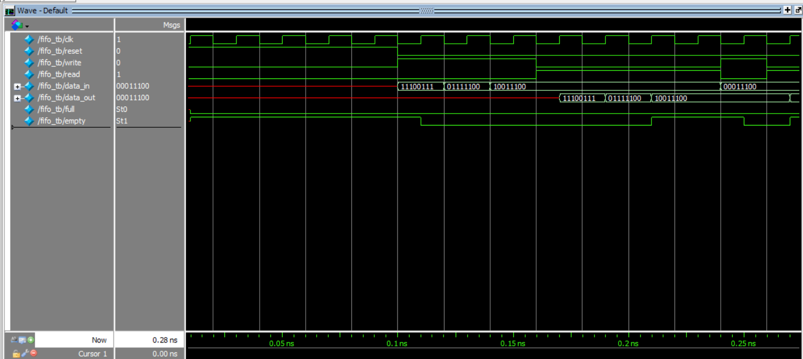
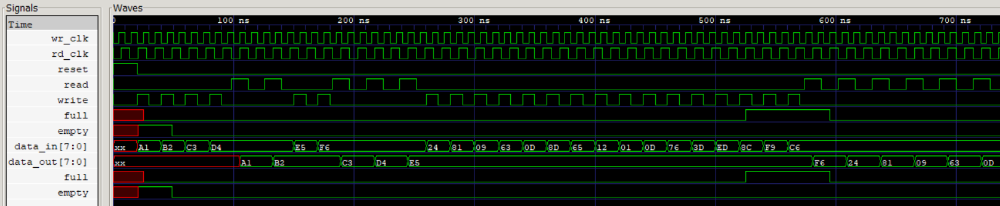

# FIFO Design (Synchronous & Asynchronous)

This repository contains Verilog implementations and testbenches for both **Synchronous FIFO** and **Asynchronous FIFO** designs.  
The designs are verified using simulation waveforms and focus on correct pointer management, full/empty detection, and safe data transfer.

---

## Repository Structure

```text
FIFO/
├── sync_fifo/
│   ├── fifo.v
│   └── fifo_tb.v
├── async_fifo/
│   ├── asy_fifo.v
│   └── asy_fifo_tb.v
├── images/
│   ├── sync_fifo_waveform.png
│   └── async_fifo_waveform.png
└── README.md
```

---

## Synchronous FIFO

### Description

The **Synchronous FIFO** operates using a single clock for both read and write operations.
It is implemented using binary read and write pointers with full and empty flag logic.

The FIFO does not shift data internally; instead, memory locations are accessed using pointers.

---

### Module Interface

```verilog
module fifo #(parameter WIDTH = 8, DEPTH = 8)(
    input clk,
    input reset,
    input write,
    input read,
    input [WIDTH-1:0] data_in,
    output reg [WIDTH-1:0] data_out,
    output full,
    output empty
);
```

---

### Key Features

* Single clock domain
* Binary read and write pointers
* Full and empty status flag generation
* Supports simultaneous read and write operations
* Pointer-based memory access (no data shifting)

---

### Design Notes

* Pointer width is fixed to **3 bits**, matching a FIFO depth of **8**
* The `DEPTH` parameter is intended for configuration but pointer width must match depth
* Reset initializes read and write pointers to zero and asserts the empty condition

---

### Waveform

The waveform below demonstrates correct FIFO behavior including reset, write, read, full, and empty conditions:



---

## Asynchronous FIFO

### Description

The **Asynchronous FIFO** supports independent read and write clock domains.
It uses **Gray-code pointer synchronization** to safely transfer pointer values across clock boundaries and avoid metastability.

Binary pointers are converted to Gray code before synchronization, and full/empty detection is performed using synchronized pointers.

---

### Module Interface

```verilog
module asy_fifo #(parameter WIDTH = 8, DEPTH = 16)(
    input rd_clk,
    input wr_clk,
    input reset,
    input read,
    input write,
    input [WIDTH-1:0] data_in,
    output reg [WIDTH-1:0] data_out,
    output full,
    output empty
);
```

---

### Key Features

* Dual clock domains (read and write)
* Binary-to-Gray and Gray-to-binary pointer conversion
* Double-flop synchronizers for CDC safety
* Extra MSB used for reliable full/empty detection
* Supports simultaneous read and write operations

---

### Design Notes

* FIFO depth is **16**, and pointer width is fixed accordingly
* Reset is assumed to be asserted to **both clock domains**
* Full condition is detected using inverted MSB comparison of synchronized pointers
* Empty condition is detected when synchronized read and write pointers are equal

---

### Waveform

The waveform below demonstrates correct operation across asynchronous clock domains:



---

## Simulation & Verification

* Separate testbenches are provided for synchronous and asynchronous FIFOs
* Independent clocks are generated in the asynchronous FIFO testbench
* Reset, full, empty, and simultaneous read/write scenarios are verified
* Waveforms confirm correct functional behavior

---

## Design Assumptions & Limitations

* FIFO depth is fixed to match pointer width in the current implementation
* FIFO depth is assumed to be a power of 2
* Reset is assumed to be cleanly asserted to all relevant clock domains
* Designs focus on functional correctness rather than throughput optimization

---

## Author

Designed and verified as part of FIFO RTL design and validation practice.

